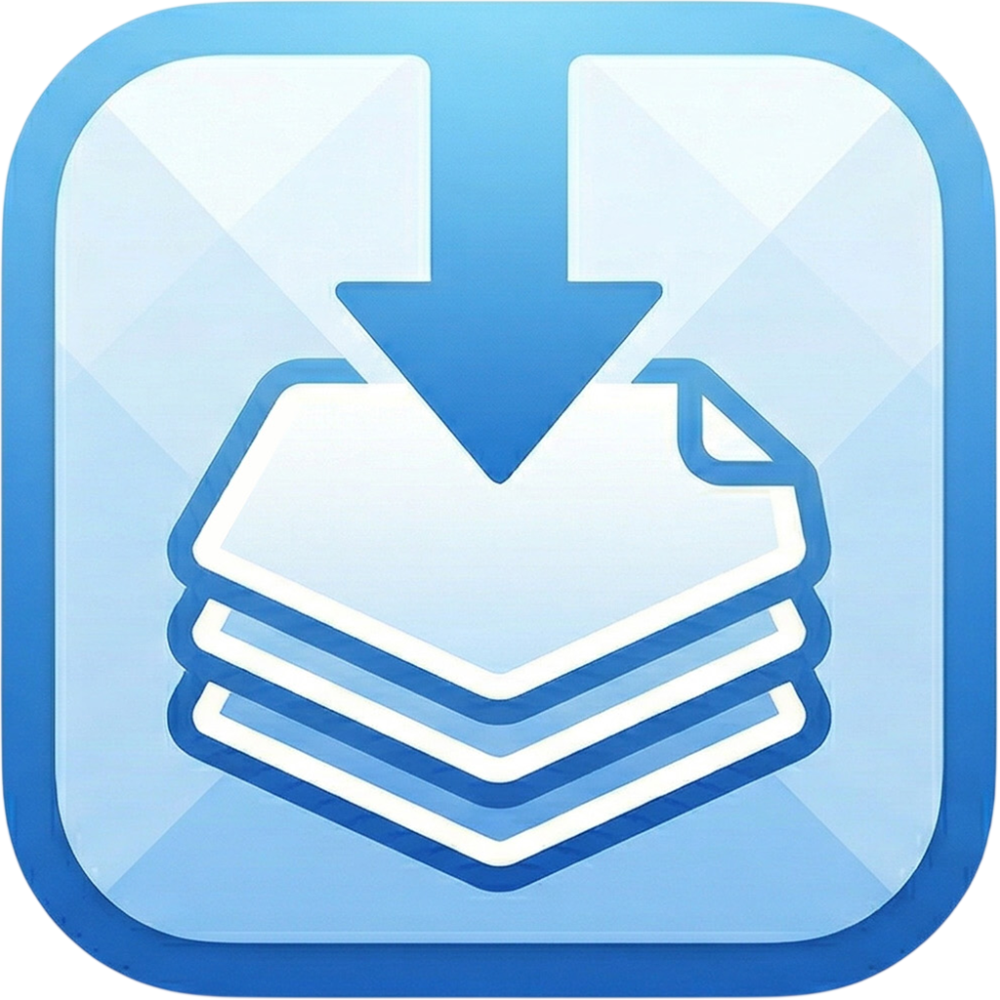

# Macshelf

**A lightweight, beautiful shelf for macOS.**  
Drop files, links, and text while you work — drag them out whenever you need them.

 

[**Website →**](https://ahsdev.com.tr/macshelf/) · [**Download →**](#-download)

---

## Overview

Macshelf is a tiny floating shelf that lives on the edge of your screen. It appears automatically when you start dragging a file, link, or piece of text — and vanishes when you're done. Think of it as a clipboard you can see and drag out of, not just paste from.

It is a free, open-source alternative to [Yoink](https://eternalstorms.at/yoink/) with a modern Liquid Glass UI designed for macOS 26.

---

## 📹 Demo

---

## ✨ Features

- **Zero friction** — the shelf appears only when you drag a file, link, or text. Window moves and resizes never trigger it.
- **Drop anything** — local files & folders, web URLs, plain text snippets. All treated as first-class items.
- **Drag back out** — every item on the shelf is fully draggable. Drop it anywhere that accepts files or text.
- **Auto-clean** — an item is removed from the shelf the moment its drop is accepted by the destination.
- **Always on top** — floats above all windows, works across every Space and full-screen app.
- **Liquid Glass UI** — designed from scratch for macOS 26 with frosted glass, smooth spring animations, and pixel-perfect Retina rendering.
- **Featherweight** — no background agents, no persistent services. Near-zero CPU and memory when idle.

---

## 💾 Download

**Macshelf requires macOS 26 or later.**

1. Go to the [**Releases**](https://github.com/alihaktan35/Macshelf/releases/latest) page.
2. Download `Macshelf.app` from the latest release.
3. Drag **Macshelf.app** to your Applications folder, and launch it.

> Macshelf is a menu-bar-less accessory app — it won't appear in your Dock or ⌘-Tab switcher. To quit, right-click the grip bar at the top of the shelf and choose **Quit MacShelf**.

---

## How It Works

| Step | What happens |
|------|-------------|
| Start dragging a file, link, or text anywhere on your Mac | Macshelf slides in from the right edge of your screen |
| Drop the item onto the shelf | It's stored there, ready whenever you need it |
| Drag it back out from the shelf | Drop it into any app, Finder window, email, browser — anywhere |
| Release the mouse with an empty shelf | The panel fades out automatically |

---

## Requirements

| | |
|---|---|
| **OS** | macOS 26 (Tahoe) or later |
| **Architecture** | Apple Silicon & Intel |
| **Disk space** | < 5 MB |

---

## 🛠 Contributing

Macshelf is open source and contributions are welcome.

- **Bug reports & feature requests** → [open an issue](https://github.com/alihaktan35/Macshelf/issues)
- **Pull requests** → fork the repo, make your changes on a branch, and open a PR against `main`

The codebase is intentionally small — five Swift files, no third-party dependencies.

---

## License

Macshelf is released under the [MIT License](LICENSE).  
© 2026 Ali Haktan Sığın

---

Made by [@alihaktan35](https://github.com/alihaktan35) · [ahsdev.com.tr](https://ahsdev.com.tr) · [macshelf website](https://ahsdev.com.tr/macshelf/)

